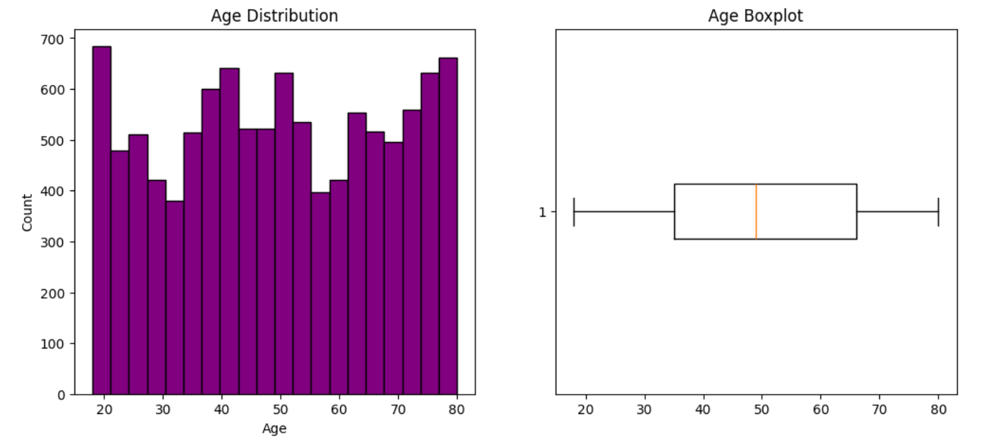
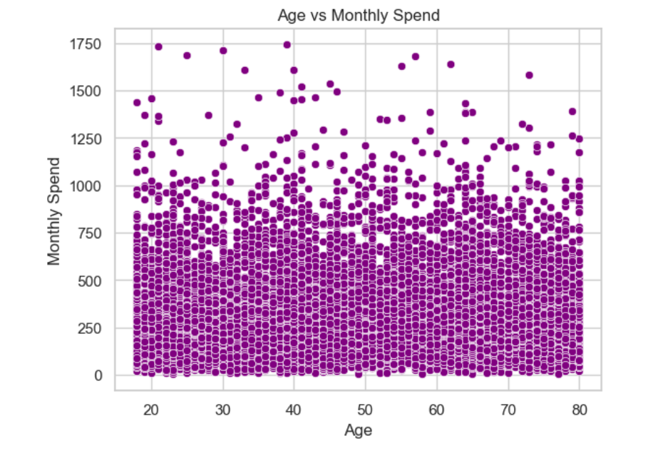
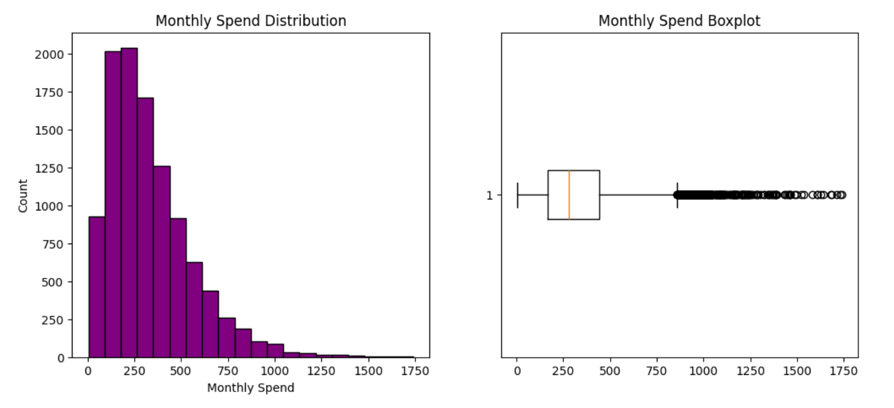
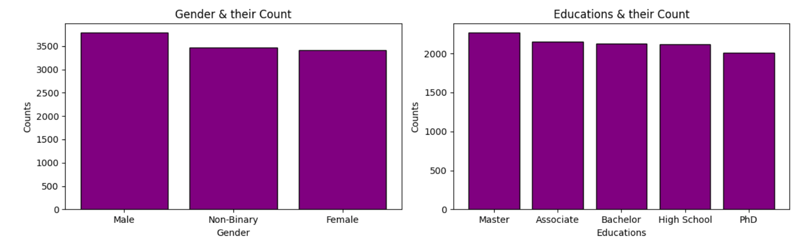
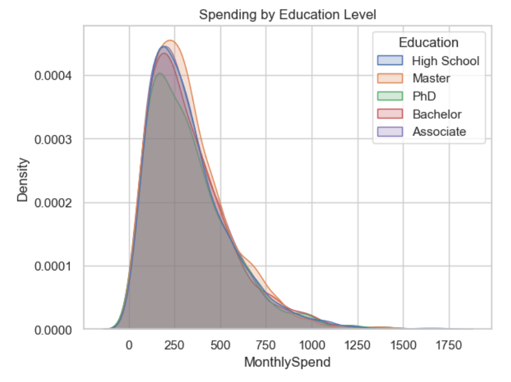

# Customer Insights – A Statistical Investigation

## Project Objective
The objective of this project is to analyze customer data using statistical techniques to identify the key drivers of monthly spending. The focus is on validating business assumptions through hypothesis testing and deriving data-driven insights.

---

## Business Problem Statement
A retail company has access to customer demographic and transactional data but lacks clarity on:

- Whether demographic factors influence spending  
- Which customers contribute most to revenue  
- How to design effective marketing strategies  

This project aims to replace assumption-based decisions with statistically validated insights.

---

## Dataset Description

The dataset contains customer-level information including:

### Demographic Variables
- Age (18–80 range)  
- Gender (Male, Female, Non-Binary)  
- Education Level (High School, Bachelor, Master, Associate, PhD)  
- State  

### Transactional Variable
- Monthly Spend  

### Behavioral Variables
- Engagement metrics  
- Days Since Last Interaction  

### Lifestyle Variables
- Pet Ownership  
- Marital Status  

---

## Visualizations

### Age Distribution

This plot shows that customer age is evenly distributed across different age groups.  
There are no extreme outliers, indicating a balanced dataset.

---

### Age vs Monthly Spend

The scatter plot shows no clear relationship between age and spending.  
Spending behavior appears independent of age.

---

### Monthly Spend Distribution

The distribution is right-skewed, meaning most customers spend less.  
A small group of customers contributes significantly higher spending.

---

### Gender and Education Distribution

Customers are fairly evenly distributed across gender and education categories.  
This indicates no strong imbalance in demographic representation.

---

### Spending by Education Level

Spending patterns are similar across all education levels.  
This suggests education does not significantly impact spending behavior.

---

## Key Analysis Performed

- Data Cleaning and Preprocessing  
- Exploratory Data Analysis (EDA)  
- Correlation Analysis  
- Hypothesis Testing:
  - t-test (Gender vs Spend)  
  - ANOVA (Education, State vs Spend)  
  - Chi-square test (Pet Ownership vs Marital Status)  
  - Correlation analysis (Age vs Spend)  

---

## Key Findings

- No significant difference in spending across gender, education, or state  
- Age has no strong relationship with spending  
- Most variables show weak correlations  
- Presence of high-value customers (right-skewed distribution)  
- Significant relationship between pet ownership and marital status  

---

## Business Recommendations

1. Avoid demographic-based segmentation  
2. Use behavioral segmentation  
3. Focus on high-value customers  
4. Apply niche targeting (pet ownership & marital status)  
5. Use inclusive marketing strategies  
6. Improve customer engagement  
7. Use multi-factor decision making  
8. Adopt a data-driven approach  

---

## Conclusion

Customer spending is not driven by demographic factors but by behavioral patterns.  
Businesses should focus on data-driven and behavior-based strategies for better results.

---

## Live Project
 https://raj2534567-droid.github.io/Customer-Insights---A-Statistical-Investigation/
---

## Author
Rajeshwari Patel  
Aspiring Data Analyst
